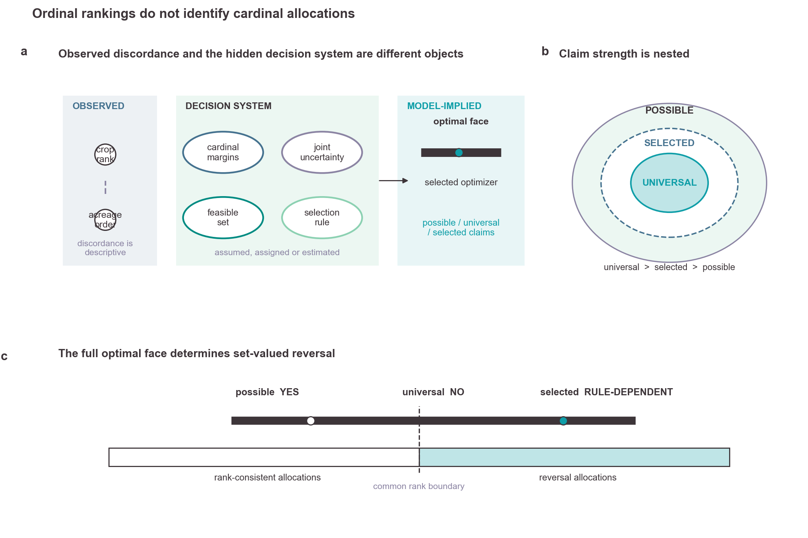

# Why crop rankings do not determine land allocation

> A reproducible theory, simulation, and official-data study of the gap between **ordinal crop rankings** and **cardinal acreage decisions**.

[](https://www.python.org/)
[](#reproduce-the-study)
[](#research-status)

[Read the main paper](output/pdf/crop_ranking_reversal_main_supervisor_review.pdf) · [Read the Supplementary Information](output/pdf/crop_ranking_reversal_supplementary_supervisor_review.pdf) · [Explore the figures](figures/goal17/main) · [Reproduce the study](#reproduce-the-study)



## The question

Crop-ranking systems answer an ordinal question: **which crop scores higher?** Farmers and planners face a different, cardinal question: **how much land should each crop receive?**

This paper asks what can—and cannot—be inferred when a public crop ranking disagrees with observed acreage. Its central conclusion is:

> **A crop ranking alone does not identify an acreage allocation.** The conversion from prediction to prescription also requires cardinal margins, joint uncertainty, operational constraints, downside-risk conventions, and a rule for selecting among multiple optima.

## What this study does

| Evidence layer | What we do | What it establishes |
|---|---|---|
| **Theory** | Formulate a set-valued, multi-crop stochastic programme with operational constraints and loss-CVaR | Distinguishes *possible*, *universal*, and *selected* ranking reversal; proves that ranks alone do not identify acreage |
| **Mechanism atlas** | Construct exact examples for cardinal margins, operational restrictions, downside risk, and multiple optima | Shows why visually similar rank–acreage disagreement can arise from different mechanisms |
| **Pre-specified simulation** | Run six experiment families with optimal-face audits, replay checks, solver checks, and family-wise precision gates | Identifies operational displacement and information–flexibility interactions in their declared simulation domains |
| **Official-data analysis** | Reconstruct a US state panel for corn, soybeans, and wheat from USDA and BLS sources | Documents how rank–acreage disagreement changes across score definitions, states, years, and aggregation levels |
| **Reproducibility** | Freeze source snapshots, generate figures and manuscript inputs, validate claims, and build the PDFs twice | Makes the computational path from data and model to paper auditable |

## Main findings

### 1. Operational constraints can force universal reversal

In the assigned-intervention experiment, the baseline allocates all land to corn. Contract, rotation, budget, and crop-bound interventions instead produce soybean-majority allocations in every treated cell. Reversal holds across the **complete optimal face**, not only at one solver-selected point, and all **24/24 family-wise intervals** pass the pre-specified precision criterion.

### 2. Information and flexibility do not have a universal relationship

The value of information depends on the actions it can change. Across constructive environments, the information–flexibility interaction is positive, exactly zero, or substitutive. Better information is therefore not automatically more valuable under a larger action set.

### 3. Public acreage disagreement is descriptive, not a mechanism test

The official panel contains **744 complete state–crop–year rows**, covering **248 complete state-years in 31 states from 2016–2024**. Concurrent operating-margin inversion intensity is **0.411** (state-cluster 95% interval: **0.346–0.475**), but the result changes with the score definition and aggregation level. Every primary strictly lagged acreage-share interval includes zero.

These data make disagreement visible; they do **not** identify private objectives, constraints, beliefs, dependence, risk preferences, causality, or welfare.

### 4. Inconclusive experiments remain visible

Four of the six pre-specified simulation families reached their replication ceilings without satisfying every experiment-level precision gate. They remain in the Supplementary Information rather than being promoted through isolated significant or visually persuasive contrasts.

## The identification boundary

```text
Observed                     Required decision system                 Model output
────────                     ────────────────────                 ────────────
crop ranking  ─┐               cardinal margins  ─┐
               ├── disagreement   joint uncertainty ├── optimal face ── selected allocation
acreage order ─┘               feasible set       │
                               selection rule     ─┘
```

A mismatch between the two observed objects does not reveal which hidden component generated it. Mechanism claims become available only when the corresponding component is observed, assigned, or credibly estimated.

## Reproduce the study

Python 3.11 is the canonical runtime. The locked environment uses [`uv`](https://docs.astral.sh/uv/).

```bash
git clone git@github.com:RyanLu0203/crop-ranking-reversal.git
cd crop-ranking-reversal
uv sync --locked --extra test
make paper
make check
```

- `make paper` performs isolated deterministic builds of the main paper and Supplementary Information, renders the pages, and validates the release package.
- `make check` runs the repository, theory, literature, data, simulation, empirical, visualization, manuscript, and final-package validators together with the canonical test suite.
- Frozen raw files are never overwritten. [`scripts/download_official_data.py`](scripts/download_official_data.py) verifies their bytes and reports source revisions in a separate staging directory.

## Repository map

| Path | Contents |
|---|---|
| [`manuscript/`](manuscript) and [`supplementary/`](supplementary) | Modular LaTeX sources and generated manuscript inputs |
| [`theory/`](theory) | Model specification, theorem audit, proofs, counterexamples, and edge cases |
| [`optimization/`](optimization) | CVaR optimizer, optimal-face audit, benchmark policies, and mechanism checks |
| [`simulation/`](simulation) | Frozen experiment designs, scenarios, confirmatory outputs, and seeds |
| [`empirical/`](empirical) | Official-data parsing, score construction, panel analysis, and validation |
| [`data/`](data) | Frozen source snapshots, contracts, processed panels, and provenance |
| [`figures/`](figures) and [`tables/`](tables) | Publication assets in screen and submission formats |
| [`evidence_registry/`](evidence_registry), [`audits/`](audits), and [`provenance/`](provenance) | Claim-level evidence boundaries, checksums, and reproducibility records |
| [`output/`](output) | Built PDFs, QA contact sheets, logs, manifests, and release archive |

## Research status

This repository contains a **scientific draft for supervisor review**, not a published paper. Author names, affiliations, venue, DOI, and final citation are intentionally not claimed here. The teacher draft in [`baselines/teacher_draft/`](baselines/teacher_draft) fixes the research question and model architecture but is not treated as empirical evidence; every promoted result is independently regenerated and validated.

## Responsible interpretation

The practical message is procedural. A system that recommends acreage should disclose the decision model connecting scores to feasible actions. When that model is unavailable, the defensible claim concerns **ranking correspondence**, not optimal land allocation. The study does not estimate farm-level welfare, infer private constraints from public acreage, or claim that every observed reversal is rational or optimal.

## Citation

A citable release and final bibliographic record will be added after authorship and submission details are confirmed. Until then, please cite this repository by title and commit hash so that the exact research artifact remains identifiable.
