# GOAL-17 visual exploration and selection record

## Procedure

Two meaningfully different concepts were rendered for each of the six main scientific questions. Every candidate uses the fixed six-colour card, Python/matplotlib, editable vector text and a final width of 183 mm. The 12 candidates, dimensions, PNG hashes and vector paths are recorded in `audits/goal17_visual_candidates/candidate_manifest.csv`.

Review views:

- full colour: `audits/goal17_visual_candidates/contact_sheet.png`;
- grayscale: `audits/goal17_visual_candidates/contact_sheet_grayscale.png`;
- simulated deuteranopia: `audits/goal17_visual_candidates/contact_sheet_deuteranopia.png`;
- simulated protanopia: `audits/goal17_visual_candidates/contact_sheet_protanopia.png`.

All comparisons were performed at final physical size, not on an enlarged design canvas. Titles and annotations use reserved bands. Long treatment labels and adjacent-panel labels were reflowed after full-size inspection. The first Figure 4A draft was explicitly rejected because a repeated 3-by-8 classification matrix and three prose cards consumed space without adding comparisons; it is not the selected design and was replaced in the versioned candidate set.

## Rendered final-size candidate thumbnails

| Scientific question | Concept A | Concept B |
|---|---|---|
| 1. Ordinal rank versus cardinal allocation | 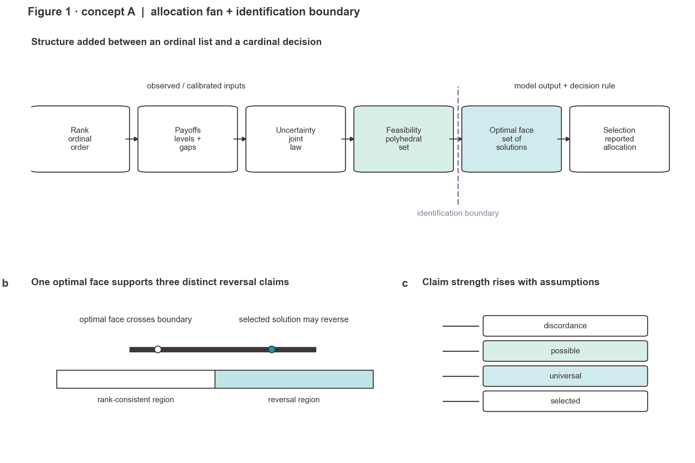 | 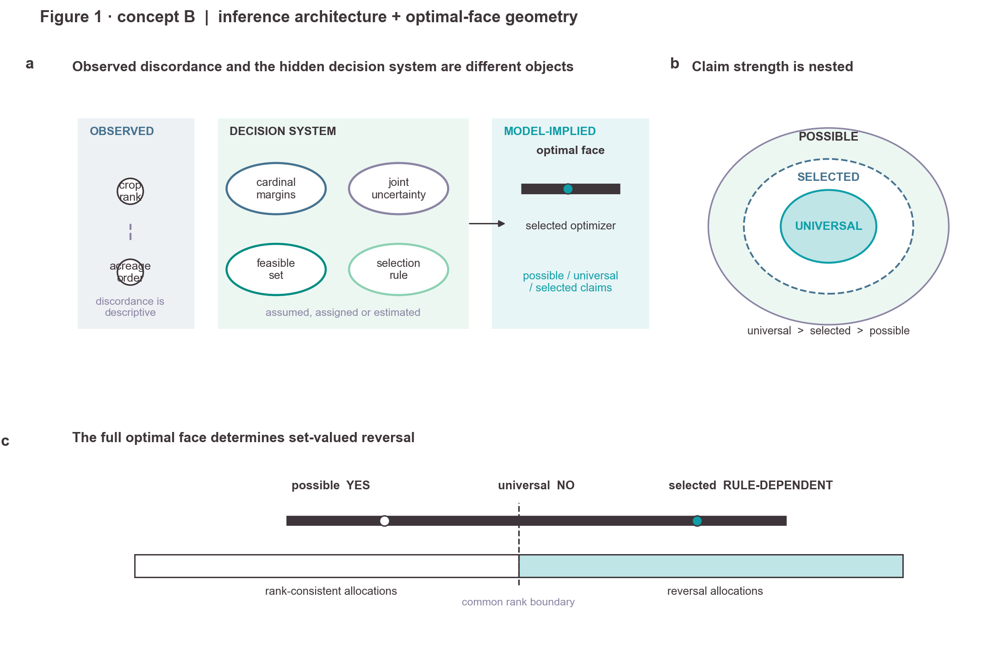 |
| 2. Mechanisms with the same disagreement | 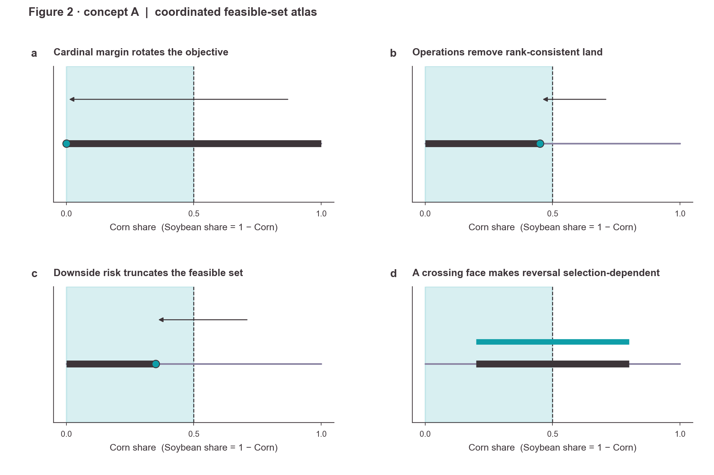 | 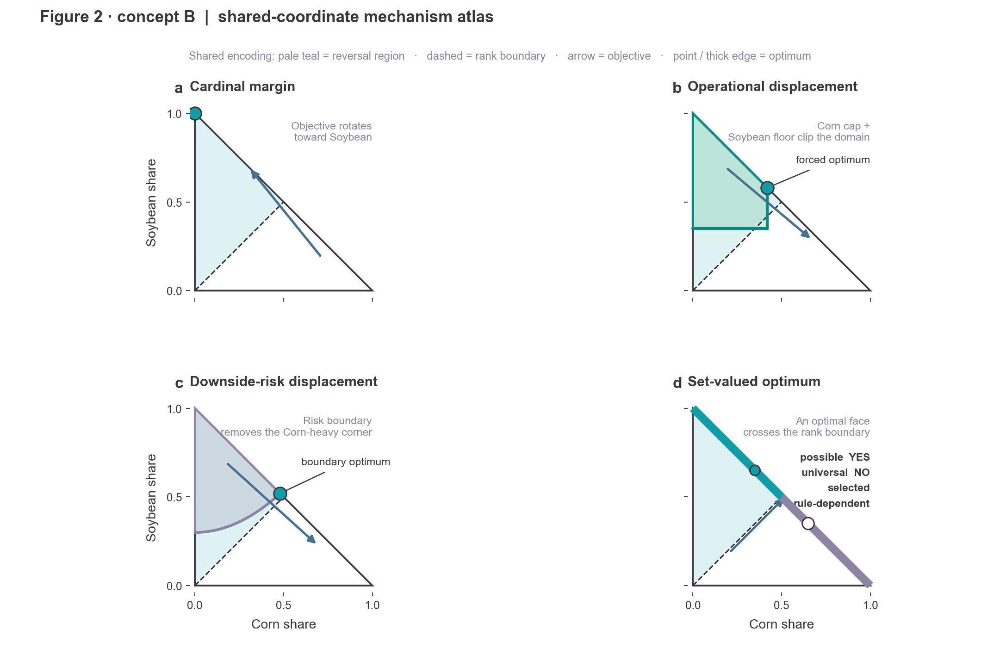 |
| 3. Model-component path and pressures | 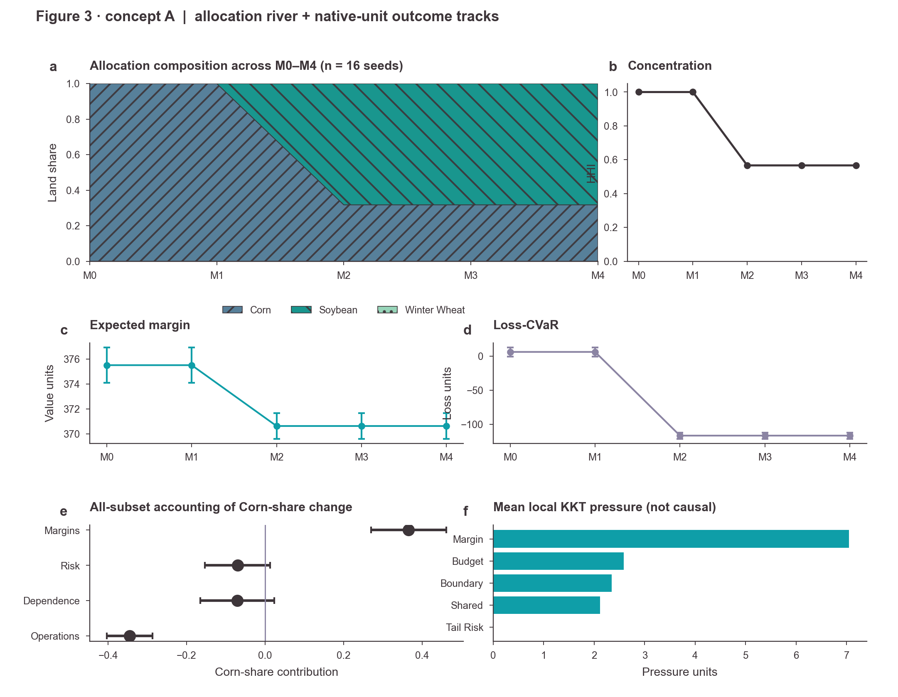 | 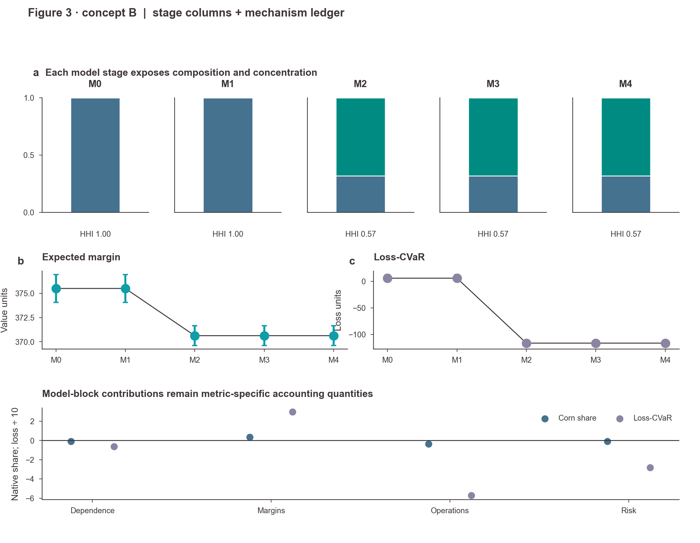 |
| 4. Assigned operational interventions | 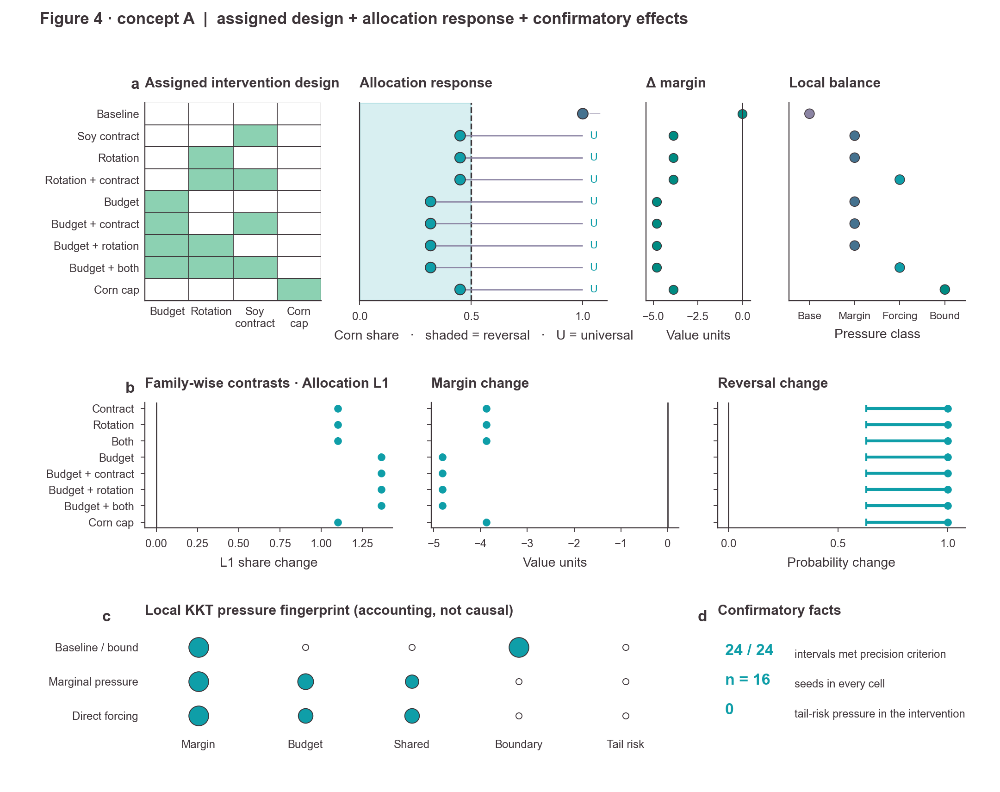 | 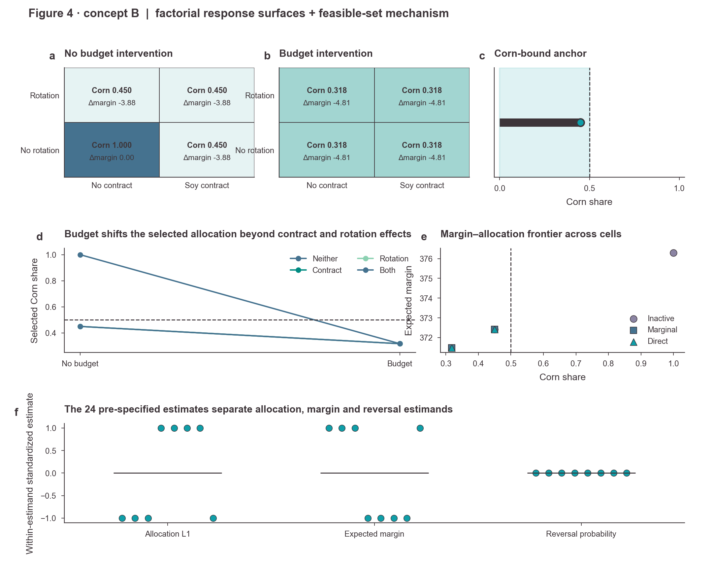 |
| 5. Information--flexibility archetypes | 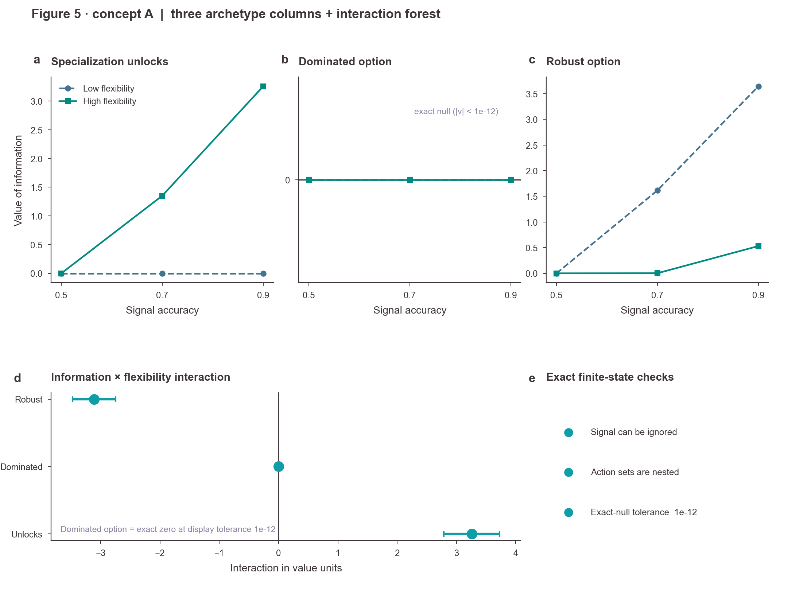 | 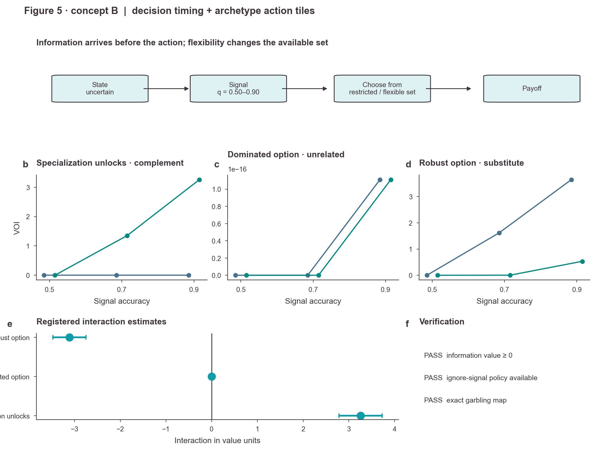 |
| 6. Empirical place, time and definition | 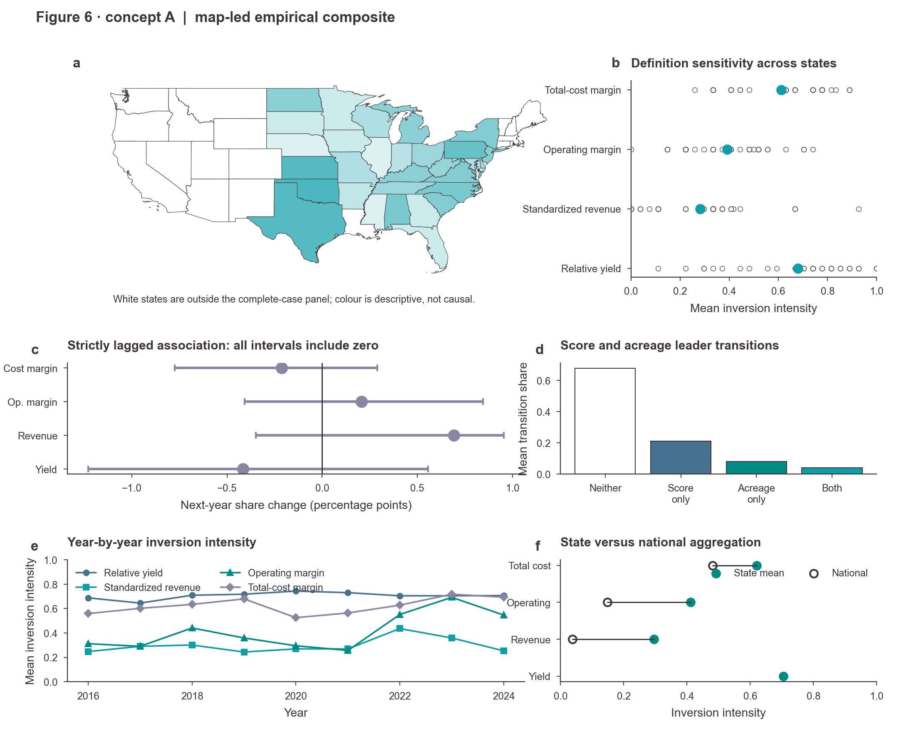 | 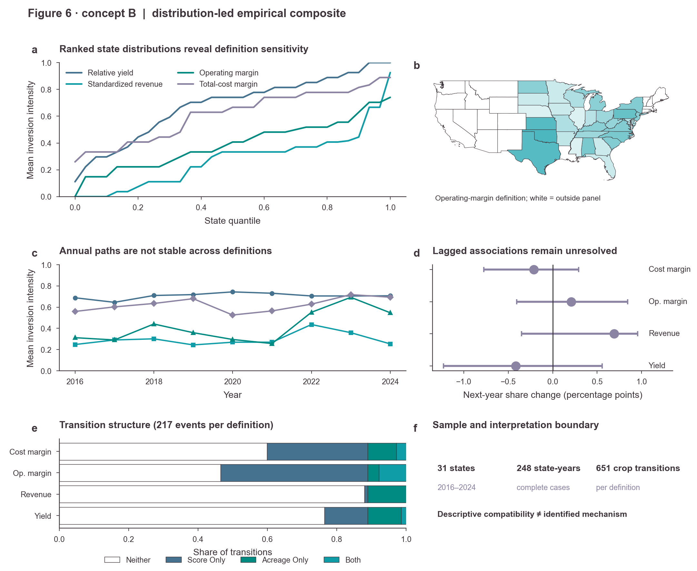 |

## Candidate comparison and selection

| Group | Concept A | Concept B | Density and accessibility comparison | Selected direction |
|---|---|---|---|---|
| Figure 1 | Allocation fan, shared optimal-face axis and claim ladder. Strong sequential logic, but the six-stage path still resembles a flow diagram. | Claim-by-required-object matrix plus observability panel and optimal-face strip. Makes assumption requirements and the distinction among reversal definitions directly comparable. | A is easier to narrate; B carries more non-redundant information per unit area. Both survive grayscale because boundaries and symbols remain visible. | **Hybrid led by B**: retain B's claim matrix and A's clearest shared optimal-face strip; remove low-value prose boxes. |
| Figure 2 | Four coordinated one-dimensional feasible-set panels with common reversal boundary. Easy comparison, but each panel leaves substantial unused vertical area. | One common geometric domain plus four compact mechanism fingerprints. Makes the shared boundary and mechanism differences visible simultaneously. | B has stronger hierarchy and density. The optimal face and feasible interval remain distinct in grayscale through position and line weight. | **B**, with more explicit objective/constraint arrows borrowed from A. |
| Figure 3 | Allocation river as hero, native-unit value/risk tracks, concentration, all-subset accounting and signed KKT pressure. | Five stage columns, native-unit outcomes and a compact contribution ledger. | A communicates model progression more continuously and avoids repeated stage scaffolding. Crop fills partially converge in grayscale, so the final version will add boundaries/hatches and direct endpoint labels. | **A**, with the compact stage headings from B and redundant crop encodings. |
| Figure 4 | Integrated experiment ledger: factor presence, selected Corn share, universal status, margin change and mechanism class aligned row by row; all 24 contrasts are grouped by estimand; KKT pressure fingerprint and retained information complete the argument. | Two factorial response surfaces, a Corn-bound anchor, budget-response slopes, a margin–allocation frontier and an estimand distribution. | The original A was rejected after review for repeated cells and prose cards. The rebuilt A has the highest useful density and preserves exact treatment-to-mechanism linkage. B exposes interaction structure but its standardized bottom panel is less immediately interpretable. Both use position and outline in addition to colour. | **Rebuilt A**, with the budget-response slope from B considered for a supplementary panel. |
| Figure 5 | Three aligned archetype-specific VOI panels, interaction forest and exact verification strip. | Decision-timing schematic, archetype tiles, forest and verification panel. | A makes complement/null/substitute comparison immediate and avoids a six-line legend. B adds timing intuition but spends more space on schematic structure. Lines remain identifiable in colour-vision simulations; final grayscale QA requires distinct markers and line styles. | **A**, with a compressed timing strip from B. |
| Figure 6 | Map-led composite with state distribution, strictly lagged forest, transition composition, annual paths and aggregation comparison. | Distribution-led composite with supporting map, annual paths, lagged forest, transition structure and sample boundary. | A gives geography editorial priority; B makes score-definition sensitivity more quantitative. Both preserve missing states as white outlines and keep causal-boundary text outside the map. Dense line panels need redundant markers in grayscale. | **Hybrid led by A**: large map, B's ranked-state distribution, lagged forest, transition structure and compact aggregation/sample evidence. |

## Information-density decisions carried into final design

1. Repeated binary cells are removed when every treated row has the same classification. A single `U` status aligned with the selected allocation carries the universal-reversal fact without repeating possible/selected columns.
2. Treatment factors and outcomes share row alignment so a reader can trace intervention → selected allocation → margin change → mechanism without legend lookup.
3. E2 uncertainty is shown once for each of all 24 registered contrasts, grouped into allocation, margin and reversal estimands rather than eight copies of one conclusion.
4. E6 uses three archetype columns and direct two-line comparison instead of six competing series.
5. The empirical group reserves the large visual field for spatial and distributional evidence; interpretation boundaries occupy a separate annotation lane.
6. Text cards are retained only for compact verification facts that cannot be represented as a quantitative mark.

## Collision, bounds and readability review

- Full-size raster inspection identified and corrected: Figure 3B's spanning title collision; Figure 4A's clipped treatment names; the first Figure 4A's low-density repeated matrix; and Figure 6's cross-panel tick-label intrusion.
- No selected concept places a title, label or annotation over a data mark. Direct labels, where retained, use an empty endpoint lane.
- No essential text in the candidate system is below 5.5 pt; final scientific labels target 6--7 pt.
- Grayscale review shows that crop and definition colours must receive redundant hatch, marker or line-style encodings in the final implementation. This is a required final QA item, not an optional polish step.
- Deuteranopia and protanopia simulations retain promoted versus adverse evidence through filled/open marks, solid/dashed boundaries and spatial grouping.
- The map uses official 2024 Census generalized state geometry only as a display scaffold. Its source URL, feature count and SHA-256 are recorded in `data/goal17/source_registry.csv`.

## Final implementation freeze

The final six groups will implement the selected/hybrid directions above. Candidate files remain immutable evidence of exploration. Final figures must additionally export 300-dpi PNG, 600-dpi TIFF, SVG and vector PDF; validate embedded colours; pass full/grayscale/deuteranopia/protanopia review; and report zero clipping or text--mark collisions.
