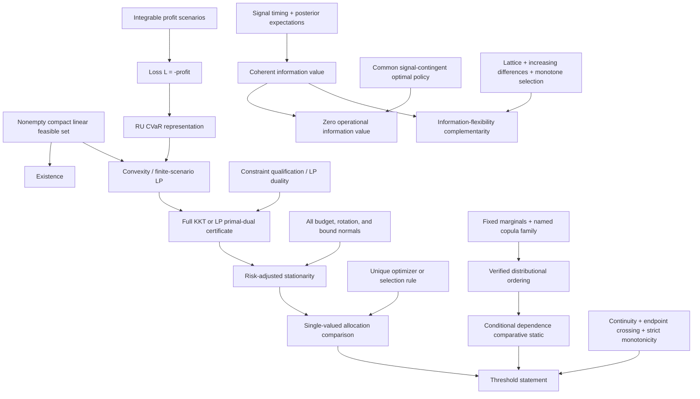

# Proof dependency graph

The teacher draft reaches allocation ordering from `S`, threshold uniqueness without `U`, `O`, or `N`, and complementarity without `LAT`. Those missing branches are substantive proof gaps, not stylistic omissions.
